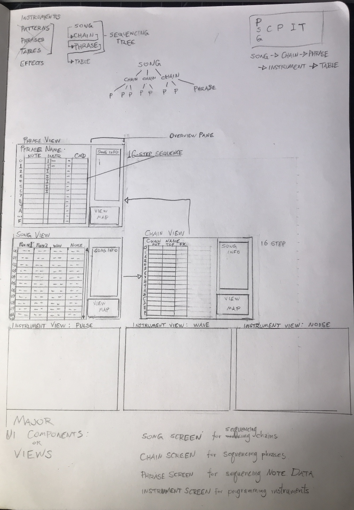

# JSDJ

#### A browser-based DAW build with Tone.js, React and Redux, February 23rd, 2018

#### By **Luke Bertram**

## Description

JSDJ aims to be a small-scale digital audio workstation (DAW) that will allow users to compose and play back simple chip-music-style songs in the browser. It is being built as a capstone project for my JavaScript/React studies at Epicodus code school in Portland, OR.

## Project Notes

I've spent a lot of time thinking about how this project is going to look without even knowing if the Tone.js library is capable of offering the kind of controls necessary for the tracker-style interface I've been considering. In this initial phase of the project, it seems more important to dig into Tone.js and see what it can do. Once I understand how to implement its features I'll have a better idea of what controls are even available to include in the UI. Then I can figure out how to lay them out.

### Application Layout



The JSDJ app layout will (eventually) consist of several swappable views inside a single page application. The 3 most important of these views, Song, Chain, and Phrase, are for programming musical sequences of notes.

**Phrase**
This is the heart of the entire Application, as it is where actual note information is entered into a 16-step timeline representing a single channel. Each of the steps in the timeline represents a sixteenth note subdivision of a measure in 4/4 time, and each individual Phrase timeline represents a single measure.

**Chain**
The Chain sequencing screen is the next step up from the Phrase sequencer and allows the user to arrange phrases along a 16 measure timeline. It is very much like the Phrase view, but working with user-sequenced phrases instead of notes. The Chain sequencer, like the Phrase sequencer, deals with only one of the several channels that make up the entire song.

**Song**
The Song sequencing view is the highest-level view of a song's contents and allows for the arranging of successive Chain patterns in all four audio channels at once for up to 256 consecutive Chains. When the play command is issued from this screen, the full song plays including all four channels.

### ToneJS Notes

#### Transport
This is the central time-keeper in Tone.js. This is how notes can be played back with a higher amount of precision than something like setTimeout() would allow for. The trigger of every note attack, release, etc is passed as a callback to the Transport along with a `time` argument that tells the Transport when to trigger it.

#### Time

>All methods which take time as an argument accept a String or Number. Time encoded as a Number is assumbed to be seconds and returned. Time encoded as a String can take various forms in order to synchronize it to the Tone.Transport.

Relevant Examples of Time Format:

**Notation**
Describes time in BPM and time signature relative values.
* `"4n"` = quarter note
* `"8t"` = eighth note triplet
* `"2m"` = two measures
* `"8n."` = dotted-eighth note

**Transport Time** Tempo and time signature relative time in the form **BARS:QUARTERS:SIXTEENTHS**.
* `"32:0:0"` = start of the 32nd measure
* `"4:3:2"` = 4 bars + 3 quarter notes + 2 sixteenth notes.
* `"1:2"` = 1 bar + 2 quarter notes (sixteenth notes can be omitted)

**Quantization**(for potential live input features?) Using the `@` symbol, a Time can be quantized relative to the Transport's grid.
* `"@1m"` = If the transport is started, this will return the time of the next measure

#### Instruments

All instruments have the same basic methods for triggering the attack and release of the envelopes.

##### `triggerAttack`
`triggerAttack` takes the note value as the first argument. If no time value is passed in for the second argument, the attack will be triggered immediately. The third argument is the velocity of the attack. The velocity is a value between 0 and 1 which will scale the envelope's attack and sustain values.
```
//trigger the start of a note at `time` with a velocity of 50%
synth.triggerAttack("C4", time, 0.5);
```

##### `triggerRelease`
After the attack, the note will stay at the `sustain` level until `triggerRelease` is called.
```
//trigger the release portion of the envelope immediately
synth.triggerRelease();

//trigger the release at `time`
synth.triggerRelease(time);
```

#### Polyphony with Tone.PolySynth


## Capstone Proposal
**Name of Student:** Luke Bertram

**Name of Project:** JSDJ

**Project’s Purpose or Goal:** Provide an interface for composing simple songs

List the absolute minimum features the project requires to meet this purpose or goal:

* Ability to add notes of user specified pitch and envelope to a visual grid or timeline using a mouse or keyboard

* Ability to chain musical phrases together into a longer song

* Ability to play back programmed sequences

What tools, frameworks, libraries, APIs, modules and/or other resources (whatever is specific to your track, and your language) will you use to create this MVP? List them all here. Be specific.

* React/Redux

* Tone.js library for music synthesis

* Node.js for allowing users to save song files on their own machine

If you finish developing the minimum viable product (MVP) with time to spare, what will you work on next? Describe these features here: Be specific.

* Ability to program and play back multiple channels for harmony, bass, percussion

* Ability to sign up for a user account and save files to a database

* Ability to post songs on a publicly viewable list

* Ability to share songs via copy/paste-able link

What additional tools, frameworks, libraries, APIs, or other resources will these additional features require?

* Firebase/firestore/AWS database for user info/file storage

## Tone.js Resources

* [Arpeggiator Tutorial](https://github.com/Tonejs/Tone.js/wiki/Arpeggiator)
